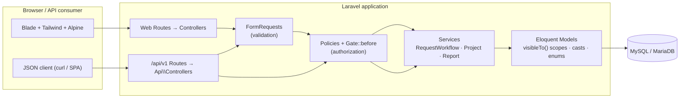
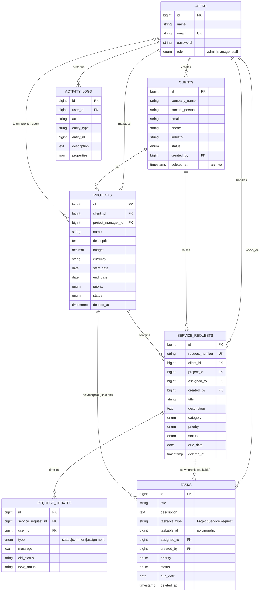

<p align="center">
  
</p>

<h1 align="center">Business Operations Management System</h1>

<p align="center">
  An internal operations platform for tracking clients, projects, service requests and tasks —
  with role-based access, a full activity trail, reporting, and a token-authenticated REST API.
</p>

---

## Overview

**BOMS** is a Laravel-based business operations management system built as a maintainable,
domain-driven monolith. It gives operations teams a single place to register clients, run
projects, log service requests through a defined status workflow, break work into assignable
tasks, and audit every important change — while enforcing per-role data visibility.

The project was delivered in four increments that mirror how a real system would be built:

| Phase | Scope |
| --- | --- |
| **1 — Core** | Authentication, roles (Admin / Manager / Staff), Clients, Projects, Service Requests, Dashboard |
| **2 — Business logic** | Status workflow, staff assignment, request timeline, activity logs, scoped search & filters, Tasks |
| **3 — Professional features** | REST API (Sanctum), Reports, CSV/Excel export, automated tests, seeders |
| **4 — Presentation** | Design system + logo, README, architecture & ER diagrams, API documentation |

## Features

- **Role-based access control** — Admin, Manager and Staff roles enforced with Laravel **Policies**
  and a `Gate::before` admin bypass. Every query is scoped through `visibleTo(User)` so staff only
  ever see records related to their own assignments.
- **Clients** — company directory with contact details, industry, status and soft-delete archiving.
- **Projects** — owned by a client, led by a manager, with an assignable team (many-to-many) and budget.
- **Service Requests** — auto-numbered (`SR-0001`), linked to a client/project, with a guarded
  **status workflow** (`new → assigned → in_progress → pending → resolved → closed`, plus `cancelled`),
  staff assignment, and a chronological **activity timeline**.
- **Tasks** — polymorphic work items attached to either a project or a request, with priority,
  status, due dates, overdue flags and self/manager assignment rules.
- **Activity logs** — a read-only audit trail of important actions, searchable and filterable
  (managers/admins only).
- **Global search & filters** — cross-entity search plus per-list filters (status, priority, client,
  assignee, category, date range, archive state) that preserve pagination and query parameters.
- **Reports & exports** — aggregate dashboards for clients, projects and service requests, with
  one-click **CSV** and **XLSX** downloads.
- **REST API** — a versioned (`/api/v1`) JSON API secured with **Sanctum** bearer tokens, reusing the
  same policies, form requests and services as the web UI.
- **Professional UI** — a Blade + Tailwind + Alpine interface built on a small, token-driven design
  system, branded with the BOMS logo and fully responsive (off-canvas drawer on mobile).

## Tech Stack

| Layer | Choice |
| --- | --- |
| Framework | **Laravel 11** on **PHP 8.2+** |
| Language features | Backed **enums**, typed models, model casts, query scopes |
| Frontend | **Blade** components + **Tailwind CSS** + **Alpine.js**, bundled with **Vite** |
| Authentication | **Laravel Breeze** (session, web) + **Laravel Sanctum** (tokens, API) |
| Database | **MySQL 8 / MariaDB** (`utf8mb4_unicode_ci`); SQLite in-memory for tests |
| Exports | **maatwebsite/excel** (CSV + XLSX) |
| Testing | **PHPUnit** feature tests |
| Code style | **Laravel Pint** (PSR-12) |

## Architecture

A conventional Laravel layout with clear boundaries. Controllers stay thin; orchestration and
invariants live in **Services**, and access rules live in **Policies**. Web and API controllers
share the same services, form requests and policies so behaviour can never diverge between them.

```
app/
├── Enums/                     # Backed enums + shared HasMeta (label/options) — the domain vocabulary
│   ├── UserRole  ClientStatus  ProjectStatus  RequestStatus
│   ├── Priority  RequestCategory  RequestUpdateType  TaskStatus
├── Http/
│   ├── Controllers/           # Web controllers (Blade)
│   │   ├── Api/               # REST controllers (Sanctum) — reuse the same services/policies
│   │   └── ...                # Client, Project, ServiceRequest, Task, Report, Search, Dashboard
│   ├── Requests/              # FormRequest validation, shared by web + API
│   └── Resources/             # API JSON resources
├── Exports/                   # maatwebsite/excel query exports (CSV/XLSX)
├── Models/                    # Eloquent models: relationships, casts, visibleTo() scopes
├── Policies/                  # Per-model authorization
└── Services/                  # RequestWorkflowService · ProjectService · ReportService
```



**Key patterns**

- **Shared authorization** — every controller (web and API) calls the same `Policy` methods; a
  `Gate::before` grants admins everything, and `viewReports` / `exportReports` gates guard reporting.
- **Visibility scoping** — `Client`, `Project`, `ServiceRequest` and `Task` expose a `visibleTo(User)`
  scope; staff queries are always filtered through it, so unauthorized records never reach a list,
  search result, report or API response.
- **Transactional workflows** — `RequestWorkflowService` wraps status transitions, assignment and
  comments in a `DB::transaction` with `lockForUpdate`, validating the transition against the
  `RequestStatus` state machine and writing both a `RequestUpdate` (timeline) and an `ActivityLog`.
- **Archiving, not deleting** — `DELETE` soft-deletes (archives) records; force-delete is admin-only.

## Database Structure



Soft-deleted (`deleted_at`) tables are **archived** rather than removed, and are hidden from lists
unless the archive filter is used.

## Installation

**Prerequisites:** PHP 8.2+ (with `pdo_mysql`, `mbstring`, `openssl`, `zip`, `gd`), Composer, Node 18+,
and MySQL 8 / MariaDB.

```bash
git clone <your-repo-url> business_operation
cd business_operation

composer install
npm install
```

## Environment Setup

```bash
cp .env.example .env
php artisan key:generate
```

Edit `.env` and point the database at your local MySQL / MariaDB instance:

```env
DB_CONNECTION=mysql
DB_HOST=127.0.0.1
DB_PORT=3306
DB_DATABASE=boms
DB_USERNAME=root
DB_PASSWORD=
```

## Database Migration

Create the `boms` database, then run the migrations (this also installs the Sanctum
`personal_access_tokens` table):

```bash
mysql -u root -e "CREATE DATABASE boms CHARACTER SET utf8mb4 COLLATE utf8mb4_unicode_ci;"
php artisan migrate
```

## Seeder

Seed a realistic demo dataset — 5 users, 10 clients, 10 projects, 20 service requests,
20 tasks and activity logs:

```bash
php artisan db:seed
```

### Demo credentials

All demo accounts use the password **`password`**. These are fake, local-only credentials.

| Role | Email | Can do |
| --- | --- | --- |
| Admin | `admin@boms.test` | Everything, including force-delete and all records |
| Manager | `manager@boms.test` | Create/edit all operational records, assign staff, reports |
| Staff | `staff@boms.test` | Create requests/tasks, update assigned work; sees only their records |

Additional seeded staff: `alex@boms.test`, `priya@boms.test`.

## Running the Application

```bash
npm run build          # compile Tailwind + Alpine assets (or `npm run dev` for HMR)
php artisan serve      # http://127.0.0.1:8000
```

Sign in at **/login** with any demo account above.

## API Documentation

A versioned JSON API under **`/api/v1`**, authenticated with **Sanctum bearer tokens**. It reuses the
same policies, form requests and services as the web UI, so role visibility and workflow rules apply
identically.

### Authentication

Exchange credentials for a token, then send it as a `Bearer` header on every request.

```bash
# 1. Get a token
curl -X POST http://127.0.0.1:8000/api/v1/auth/login \
  -H "Content-Type: application/json" \
  -H "Accept: application/json" \
  -d '{"email":"admin@boms.test","password":"password","device_name":"cli"}'

# → { "success": true, "data": { "token": "1|abcd...", "token_type": "Bearer", "user": {...} } }

# 2. Authorize requests
curl http://127.0.0.1:8000/api/v1/clients \
  -H "Authorization: Bearer $TOKEN" -H "Accept: application/json"
```

### Response envelope

Every response is wrapped consistently:

```jsonc
// success (collection)
{ "success": true, "data": [ /* … */ ], "message": "…",
  "meta": { "current_page": 1, "per_page": 15, "total": 10, "last_page": 1,
            "next_page_url": null, "prev_page_url": null } }

// error
{ "success": false, "message": "…", "errors": { "field": ["…"] } }
```

`per_page` is accepted on collections and capped at **100**.

### Endpoints

| Method | URI | Auth | Description |
| --- | --- | --- | --- |
| `POST` | `/api/v1/auth/login` | — | Issue a bearer token |
| `POST` | `/api/v1/auth/logout` | ✔ | Revoke the current token |
| `GET` | `/api/v1/auth/me` | ✔ | Current user (id, name, email, role) |
| `GET` | `/api/v1/dashboard` | ✔ | Role-scoped stats, request breakdown, recent activity |
| `GET` | `/api/v1/clients` | ✔ | Paginated, visible clients |
| `POST` | `/api/v1/clients` | ✔ | Create a client (manager/admin) |
| `GET` | `/api/v1/clients/{id}` | ✔ | Show a client |
| `PUT/PATCH` | `/api/v1/clients/{id}` | ✔ | Update a client |
| `DELETE` | `/api/v1/clients/{id}` | ✔ | Archive a client (soft delete) |
| `GET/POST` | `/api/v1/projects` | ✔ | List / create projects |
| `GET/PUT/PATCH/DELETE` | `/api/v1/projects/{id}` | ✔ | Show / update / archive a project |
| `GET/POST` | `/api/v1/service-requests` | ✔ | List / create requests (new requests start `new`) |
| `GET/PUT/PATCH/DELETE` | `/api/v1/service-requests/{id}` | ✔ | Show / update / archive a request |

Clients, projects and service requests are full `apiResource` routes (the five standard actions each).
Unauthorized access returns `403`, missing authentication `401`, validation failures `422` (with an
`errors` map), and unknown resources `404` — all in the envelope above.

## Testing

The suite runs against an in-memory SQLite database (configured in `phpunit.xml`), so it never touches
your development data.

```bash
php artisan test
```

Covers authentication, role visibility, CRUD + archiving, guarded status transitions, assignment
rules, timeline/activity logging, search & filter scoping, report access and exports, and the API
(auth, envelope, pagination, authorization, validation). **72 tests / 402 assertions.**

Code style:

```bash
./vendor/bin/pint --test   # check
./vendor/bin/pint          # fix
```

## Screenshots

The interface is branded with the BOMS logo and follows a navy/cyan design system. Drop PNGs captured
from the running demo into `docs/screenshots/` to populate this section. Each screen to capture:

| Screen | Path | What it shows |
| --- | --- | --- |
| Login | `/login` | Split-screen: navy showcase panel + branded sign-in card |
| Dashboard | `/dashboard` | Stat cards with icon chips, status chart, recent activity |
| Client list | `/clients` | Filter bar + data table with status badges |
| Client detail | `/clients/{id}` | Company info, related projects & requests |
| Project | `/projects/{id}` | Overview, team assignment, linked requests/tasks |
| Service request | `/service-requests/{id}` | Detail, status actions, assignment |
| Request timeline | (request detail) | Chronological activity with cyan markers |
| Reports | `/reports` | Aggregates + CSV/Excel export |
| Activity logs | `/activity-logs` | Searchable, filterable audit trail |

## Security

- **Authorization is server-side** — every action is gated by a Policy; the frontend only hides what
  the server would refuse anyway. Admin bypass is centralized in a single `Gate::before`.
- **Mass-assignment protection** via explicit `$fillable` and validated `FormRequest` inputs.
- **Passwords** hashed with bcrypt; **CSRF** protection on all web forms; API is stateless token auth.
- **SQL-injection-safe** — Eloquent/query builder bindings throughout; no raw user-input interpolation.
- **Scoped data** — staff cannot read or act on records outside their assignments, on web or API.
- **Demo credentials are fake and local-only.** Never seed real credentials.

## Future Improvements

Deliberately left out of the MVP to keep scope tight:

- **Notifications** — in-app alerts on assignment/status change (Laravel notifications table + an
  unread badge). The nav bell is currently a non-functional placeholder.
- **Per-role dashboards & charts** — richer analytics with a charting library.
- **API tokens UI** — user-managed personal access tokens and rate-limit visibility.
- **Fine-grained permissions** — move from the three fixed roles to granular permissions if the org
  grows more complex.
- **Queue-backed exports** — generate large CSV/XLSX reports asynchronously.
- **File attachments** on requests/tasks.

---

<p align="center"><em>BOMS — built as a maintainable Laravel business system.</em></p>
