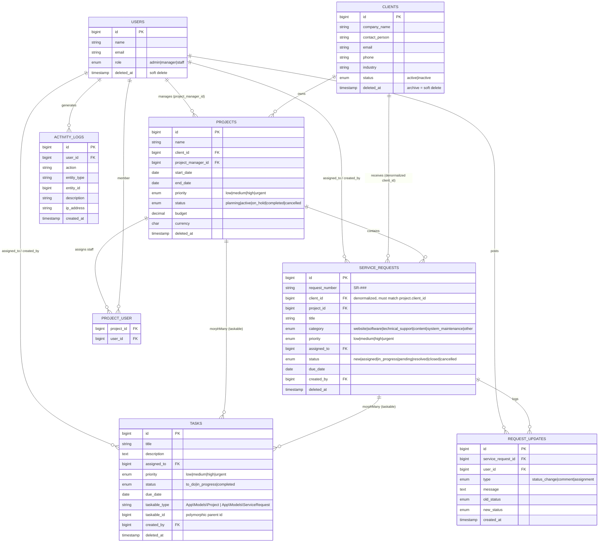

Project PRD
Business Operations Management System (BOMS)

Repository: business-operations-management-system

Target versions (pin these in the project)
PHP: 8.3+
Laravel: 11.x
MySQL: 8.0+
Frontend stack: Blade + Tailwind CSS + Alpine.js (server-rendered Blade with lightweight Alpine.js for interactive bits such as dropdowns, modals, and flash toasts). Chosen over Livewire/Inertia because the PRD prioritizes a simple, professional, maintainable UI and server-side Eloquent filtering; a JS-heavy reactive stack adds complexity without interview value here.
Export: maatwebsite/excel (CSV/XLSX)
Auth: Laravel built-in auth + Laravel Sanctum (API)
Target: Demonstrate production-style Laravel business application development.

1. Project Overview

The Business Operations Management System (BOMS) is an internal web application that allows a company to manage:

Clients
Projects
Service Requests
Staff
Tasks
Activity history
Reports

The system provides role-based access, a dashboard, searchable records, status workflows, and REST APIs.

Main workflow
Client
   ↓
Project
   ↓
Service Request
   ↓
Assign Staff
   ↓
Task / Progress Updates
   ↓
Completed
   ↓
Reports
2. User Roles
Admin

Full access.

Can:

Manage users
Manage clients
Manage projects
Manage service requests
Assign staff
View reports
View activity logs
Configure system settings
Staff

Can:

View assigned projects
View assigned service requests
Update request status
Add progress notes
Update tasks
View clients related to their assignments
Manager

Can:

View dashboard
View all clients/projects
Create projects
Assign staff
Review service requests
View reports

Role model

Roles are stored as a single enum column on the users table (users.role), not a many-to-many pivot. Three fixed, non-customizable roles do not justify a role_user pivot or a permissions package, so we keep it simple and enforce authorization with Laravel Policies + a role gate.

users.role: ENUM('admin','manager','staff') NOT NULL DEFAULT 'staff'

Check via a User::hasRole($role) helper / is_admin() etc., and gate routes/policies on this value.

Permission matrix (Role × Resource × Action)

Legend: ✅ = allowed, ❌ = denied, own = allowed only for records assigned to / created by the user.

Resource / Action        Admin   Manager   Staff
Dashboard (view)         ✅       ✅        ✅ (own)
Client   create          ✅       ✅        ❌
Client   view            ✅       ✅        own (related to assignments)
Client   update          ✅       ✅        ❌
Client   archive         ✅       ✅        ❌
Client   delete (force)  ✅       ❌        ❌
Project  create          ✅       ✅        ❌
Project  view            ✅       ✅        own (assigned)
Project  update          ✅       ✅        ❌
Project  assign staff    ✅       ✅        ❌
Project  change status   ✅       ✅        ❌
Request  create          ✅       ✅        ✅
Request  view            ✅       ✅        own (assigned/created)
Request  update          ✅       ✅        own
Request  assign staff    ✅       ✅        ❌
Request  change status   ✅       ✅        own (workflow rules apply)
Task     create          ✅       ✅        ✅
Task     update          ✅       ✅        own (assigned)
Task     delete          ✅       ✅        own (assigned)
Reports  view            ✅       ✅        ❌
Reports  export          ✅       ✅        ❌
Activity logs (view)     ✅       ✅        ❌
Users    manage          ✅       ❌        ❌
Settings configure       ✅       ❌        ❌

Notes:
Staff never see global client/project lists — only records tied to their assignments.
Manager sits between Staff and Admin: full operational reach over clients/projects/requests/reports, but no user management or system settings.
All enforcement lives in Policies (e.g. ClientPolicy@update), keeping controllers thin and testable.
3. Authentication

Use Laravel authentication.

Features
Login
Logout
Forgot password
Reset password
Remember me
Role-based authorization
Session protection

Example:

/login
/forgot-password
/reset-password

Use Laravel's built-in authentication ecosystem rather than writing authentication from scratch.

4. Dashboard

After login:

┌─────────────────────────────────────────────┐
│ Dashboard                                   │
├────────────┬────────────┬───────────────────┤
│ Clients    │ Projects   │ Open Requests     │
│ 248        │ 36         │ 18                │
├────────────┴────────────┴───────────────────┤
│                                             │
│ Service Requests by Status                 │
│                                             │
│ New           ███████                       │
│ In Progress  ███████████                   │
│ Pending       ████                          │
│ Completed     ███████████████               │
│                                             │
├─────────────────────────────────────────────┤
│ Recent Activity                             │
│                                             │
│ John updated Request #102                   │
│ Maria created Project #45                   │
│ Admin assigned Request #98                  │
└─────────────────────────────────────────────┘
Dashboard statistics
Total clients
Active projects
Open service requests
Completed requests
Pending requests
Active staff
Recent activities
5. Client Management
Client fields
ID
Company Name
Contact Person
Email
Phone
Address
Industry
Status
Created At
Updated At
Functions
Create client
View client
Edit client
Archive client
Search
Filter
Pagination

Archiving = soft delete

"Archive client" uses Laravel soft deletes (deleted_at TIMESTAMP NULL), not a status flag. The Model uses the SoftDeletes trait; the default Eloquent query excludes archived rows, and Active/Archived filters query with ->onlyTrashed()/->withTrashed(). This preserves related projects/requests and allows restore. "Archive" in the UI maps to ->delete(); a separate Admin-only "Force delete" maps to ->forceDelete(). The same soft-delete convention applies to projects and service_requests. The clients.status enum ('active','inactive') is distinct from archiving and represents business status only.

Client detail

Display:

Company Information

Projects
Service Requests
Activity History
Contacts
6. Project Management
Project fields
Project ID
Project Name
Client
Description
Project Manager
Start Date
End Date
Priority
Status
Budget
Created At
Updated At
Status
Planning
Active
On Hold
Completed
Cancelled
Priority
Low
Medium
High
Urgent

Project schema (types/constraints)

id                 BIGINT UNSIGNED AUTO_INCREMENT PRIMARY KEY
name               VARCHAR(255) NOT NULL
client_id          BIGINT UNSIGNED NOT NULL  -> FK clients.id (RESTRICT on delete)
description        TEXT NULL
project_manager_id BIGINT UNSIGNED NULL      -> FK users.id (a staff/manager user)
start_date         DATE NULL
end_date           DATE NULL                 (validate end_date >= start_date)
priority           ENUM('low','medium','high','urgent') NOT NULL DEFAULT 'medium'
status             ENUM('planning','active','on_hold','completed','cancelled') NOT NULL DEFAULT 'planning'
budget             DECIMAL(14,2) NULL        (2-dp currency amount; use DECIMAL, never FLOAT)
currency           CHAR(3) NOT NULL DEFAULT 'USD'
created_at / updated_at  TIMESTAMP NULL
deleted_at         TIMESTAMP NULL           (soft delete = archive)
Indexes: client_id, status, priority, (start_date, end_date)

Functions
Create project
Edit project
View project
Assign manager
Assign staff
Change status
Search/filter
Project activity history
7. Service Request Module

This is one of the most important modules.

Service request fields
Request Number
Client
Project
Title
Description
Category
Priority
Assigned Staff
Status
Due Date
Created By
Created At
Updated At
Categories
Website
Software
Technical Support
Content
System Maintenance
Other
Priority
Low
Medium
High
Urgent
Status
New
Assigned
In Progress
Pending
Resolved
Closed
Cancelled
8. Request Workflow

Example:

NEW
 ↓
ASSIGNED
 ↓
IN PROGRESS
 ↓
PENDING
 ↓
RESOLVED
 ↓
CLOSED

Don't allow random status changes.

For example:

New → Assigned
Assigned → In Progress
In Progress → Pending
In Progress → Resolved
Pending → In Progress
Resolved → Closed

This demonstrates actual business logic, rather than just CRUD.

9. Request Updates

Each request can have an activity timeline.

Example:

September 22, 2026

10:32 AM
John assigned the request to Maria.

11:15 AM
Maria changed status to In Progress.

1:42 PM
Maria added:
"Investigating the reported issue."

4:20 PM
Maria changed status to Resolved.

Database:

request_updates

Fields:

id
service_request_id
user_id
type
message
old_status
new_status
created_at
10. Task Management

Tasks can hang off EITHER a project OR a service request. Rather than two nullable FKs (project_id / service_request_id) with "exactly one must be set" app-enforcement, we model this as a single polymorphic relationship so one tasks table serves both parents cleanly.

A Task belongsTo a parent via taskable_type + taskable_id (Laravel morphTo). In Blade/Controllers you resolve $task->taskable to get the owning Project or ServiceRequest.

tasks.taskable_type  VARCHAR(255)  ('App\Models\Project' | 'App\Models\ServiceRequest')
tasks.taskable_id    BIGINT UNSIGNED
-> composite index (taskable_type, taskable_id)

Task
Title
Description
Assigned Staff
Priority
Due Date
Status
Parent (polymorphic: project or service request)

Status:

To Do
In Progress
Completed

Priority:

Low
Medium
High
Urgent

Task schema (types/constraints)

id             BIGINT UNSIGNED AUTO_INCREMENT PRIMARY KEY
title          VARCHAR(255) NOT NULL
description    TEXT NULL
assigned_to    BIGINT UNSIGNED NULL   -> FK users.id (SET NULL on delete)
priority       ENUM('low','medium','high','urgent') NOT NULL DEFAULT 'medium'
status         ENUM('to_do','in_progress','completed') NOT NULL DEFAULT 'to_do'
due_date       DATE NULL
taskable_type  VARCHAR(255) NOT NULL   (polymorphic parent type)
taskable_id    BIGINT UNSIGNED NOT NULL (polymorphic parent id)
created_by     BIGINT UNSIGNED NULL    -> FK users.id
created_at / updated_at  TIMESTAMP NULL
deleted_at     TIMESTAMP NULL          (soft delete)
Indexes: (taskable_type, taskable_id), assigned_to, status, due_date

11. Search & Filtering

Every major listing should support:

Clients
Search
Status
Industry
Projects
Search
Client
Status
Priority
Date
Service Requests
Search
Status
Priority
Assigned Staff
Client
Date

Use server-side filtering with Laravel Eloquent/query scopes.

12. Reports

Create a Reports section.

Reports

Client Report

Total clients
Active clients
Archived clients

Project Report

Active
Completed
Cancelled

Service Request Report

Requests by status
Requests by priority
Requests by staff
Requests by category
Export

Allow:

CSV
Excel

For example:

Service Request Report
--------------------------------
Request   Client   Status
SR-001    ABC      Completed
SR-002    XYZ      In Progress
SR-003    ABC      Pending
13. REST API

This is important for demonstrating your backend skills.

Create:

/api/v1
Authentication

Use Laravel Sanctum.

Endpoints
GET    /api/v1/clients
POST   /api/v1/clients
GET    /api/v1/clients/{id}
PUT    /api/v1/clients/{id}
DELETE /api/v1/clients/{id}

GET    /api/v1/projects
POST   /api/v1/projects
GET    /api/v1/projects/{id}
PUT    /api/v1/projects/{id}
DELETE /api/v1/projects/{id}

GET    /api/v1/service-requests
POST   /api/v1/service-requests
GET    /api/v1/service-requests/{id}
PUT    /api/v1/service-requests/{id}
DELETE /api/v1/service-requests/{id}

GET    /api/v1/dashboard

DELETE performs a soft delete (archive) to stay consistent with Section 5; only Admin may force-delete. All list endpoints are protected by the same policies as the web UI.

Response envelope

Every response returns a consistent JSON shape.

Success:
{
    "success": true,
    "data": [],
    "message": "Clients retrieved successfully."
}

Validation error (HTTP 422) — Laravel FormRequest failures:
{
    "success": false,
    "message": "The given data was invalid.",
    "errors": {
        "name": ["The name field is required."],
        "email": ["The email must be a valid email address."]
    }
}

Other error shapes (same envelope, `data` omitted):
- 401 Unauthenticated (no/expired Sanctum token)
- 403 Forbidden (authenticated but policy denies action): { "success": false, "message": "This action is unauthorized." }
- 404 Not Found (missing record)
- 405 / 429 Too Many Requests (rate limit exceeded): { "success": false, "message": "Too many attempts. Please retry later." }

HTTP status conventions: 200 GET/successful PUT, 201 POST create, 204/200 DELETE, 422 validation, 401/403 auth/authz, 404 missing, 429 rate-limited.

Pagination format

All list endpoints are paginated server-side and accept query params: ?page=1&per_page=15 (per_page capped at 100). The `data` key holds the current page's items, and a top-level `meta` block describes the page window:

{
    "success": true,
    "data": [ /* ...current page rows... */ ],
    "message": "Clients retrieved successfully.",
    "meta": {
        "current_page": 1,
        "per_page": 15,
        "total": 248,
        "last_page": 17,
        "next_page_url": "https://.../api/v1/clients?page=2",
        "prev_page_url": null
    }
}

Use Laravel's built-in ->paginate($perPage) (LengthAwarePaginator) and wrap it in an ApiResource / the standard `links`+`meta` structure so the shape stays consistent across resources.
14. Database

Suggested tables:

users               (role is an ENUM column on this table — see Role model, Section 2)
clients
projects
project_user        (pivot: staff assigned to projects)
service_requests
request_updates
tasks               (polymorphic via taskable_type/taskable_id)
activity_logs

Note: there is NO separate roles / role_user table — roles are a fixed enum on users.role (see Section 2). If customizable roles/permissions ever become a requirement, revisit a pivot or the spatie/laravel-permission package then.

Relationships
User
 ├── Projects        (belongsToMany via project_user)
 ├── Service Requests (hasMany: assigned_to / created_by)
 ├── Tasks           (hasMany: assigned_to / created_by)
 └── Activity Logs   (hasMany)

Client
 ├── Projects        (hasMany)
 └── Service Requests (hasMany)

Project
 ├── Client            (belongsTo)
 ├── Users             (belongsToMany via project_user)
 ├── Service Requests  (hasMany)
 └── Tasks             (morphMany — taskable)

Service Request
 ├── Client        (belongsTo — denormalized client_id, see note below)
 ├── Project       (belongsTo)
 ├── Assigned User (belongsTo -> users)
 ├── Updates       (hasMany)
 └── Tasks         (morphMany — taskable)

Task
 └── taskable (morphTo)  -> resolves to Project OR ServiceRequest

Service Request -> Client (redundancy decision)

A service request is linked to a Client both directly (service_requests.client_id) and transitively (request -> project -> client). We keep service_requests.client_id as a denormalized column rather than deriving it solely through Project, because:
- Client-scoped filtering (Section 11) and reports (Section 12) then avoid a mandatory JOIN through projects.
- Staff authorization ("view clients related to their assignments") is a cheap single-FK check on client_id.
- It future-proofs the (rare) case of a standalone request with no project.
Invariants & enforcement:
- client_id is derived from the selected project at creation and must equal project.client_id. Enforce this in the ServiceRequest FormRequest/Service layer, and expose a hasOne-through accessor request.client via the project when the direct value is absent.
- If a project's client changes, a model observer syncs client_id on its requests so the two never drift.

See Sections 6 and 10 for the typed projects and tasks schemas.

ER / Data-Model Diagram

GitHub renders the Mermaid diagram below. Polymorphism (tasks.taskable) cannot be expressed directly in ER notation, so tasks shows two conceptual parent links (to projects and service requests) and is explained in the notes.

Notes on the diagram:
- TASKS is polymorphic: taskable_type + taskable_id resolve to EITHER a PROJECT or a SERVICE_REQUEST (the two solid relationship lines above are conceptual; at runtime exactly one parent applies). Add a composite index on (taskable_type, taskable_id).
- ACTIVITY_LOGS.entity_type + entity_id are also polymorphic (any audited model), intentionally not drawn as fixed FK lines.
- SERVICE_REQUESTS.client_id is denormalized (see the redundancy decision above) — it duplicates the client reachable via project_id and must be kept in sync.
- All *_id FK columns are indexed; deleted_at columns mark soft-delete tables (clients, projects, service_requests, tasks).

15. Security Requirements

This is something I'd specifically demonstrate in the code.

Implement:

CSRF protection
Form Request validation
Authorization policies
Role-based access
Password hashing
Mass-assignment protection
API authentication
Input sanitization/validation
Rate limiting for API
No credentials committed to GitHub

Use:

.env.example

Never:

.env
16. Audit Log

Track important actions.

Example:

Admin created Client ABC
Maria created Project Website Redesign
John assigned Request SR-001
Maria changed SR-001 from Pending → In Progress

Table:

activity_logs

id
user_id
action
entity_type
entity_id
description
ip_address
created_at

This makes the application feel much more like a real internal corporate system.

17. UI Requirements

Keep the UI professional and simple.

Don't spend most of your time making fancy animations.

Recommended:

Sidebar
├── Dashboard
├── Clients
├── Projects
├── Service Requests
├── Tasks
├── Reports
├── Activity Logs
└── Users

Top navigation:

Search       Notifications       John ▼

(Demo user naming: the logged-in user shown in the top nav is "John" — consistent with the dashboard/activity-log examples in Sections 4, 9 and 16 which use John and Maria. Use these names only; never "Elvin".)

Scope of the "Notifications" bell: OUT OF MVP SCOPE.

There is no notification feature specified elsewhere in this PRD, so the bell icon is a non-functional placeholder for Phases 1–3. Do not build a notifications table, delivery, or UI badge in the MVP. If you want to demo it later as stretch work, the minimal version is: an in-app notifications view backed by a standard notifications table (Laravel's php artisan make:notifications-table), triggered on assignment/status-change events, with an unread-count badge in the nav. Explicitly list this under a "Future Improvements" heading in the README rather than shipping a half-built version.

The Search field in the top nav IS in scope (global search across clients/projects/requests per Section 11); only the Notifications bell is deferred.

Use responsive design so it works on:

Desktop
Tablet
Mobile
18. Laravel Architecture

I would structure the application approximately like:

app/
├── Http/
│   ├── Controllers/
│   │   ├── ClientController.php
│   │   ├── ProjectController.php
│   │   ├── ServiceRequestController.php
│   │   └── DashboardController.php
│   │
│   ├── Requests/
│   └── Resources/
│
├── Models/
│
├── Policies/
│
├── Services/
│
└── Actions/

Use Services/Actions where business logic becomes complex instead of putting everything inside controllers.

That is something you can discuss during the interview.

19. Testing

At minimum:

Feature tests
User can login
Admin can create client
Admin can create project
Staff cannot access admin functions
User can create service request
User can update request status
Unauthorized user cannot modify request
API requires authentication
Example
ServiceRequestTest

✓ authenticated user can create request
✓ user can update request
✓ invalid status transition is rejected
✓ unauthorized user cannot update request

You don't need hundreds of tests. 10–20 meaningful tests would already demonstrate that you understand automated testing.

20. Seed/Demo Data

This is extremely important for GitHub reviewers.

Create:

Admin
Manager
Staff

And seed:

10 Clients
10 Projects
20 Service Requests
20 Tasks
Activity Logs

Then the interviewer can clone the repo and immediately see a working system.

Provide demo credentials in the README, using only fake/local credentials.

21. README

Your GitHub README should contain:

# Business Operations Management System

## Overview

## Features

## Tech Stack

## Architecture

## Database Structure

## Installation

## Environment Setup

## Database Migration

## Seeder

## Running the Application

## API Documentation

## Testing

## Screenshots

## Security

## Future Improvements

Also include screenshots of:

Login
Dashboard
Client list
Client detail
Project
Service request
Request timeline
Reports
User management
22. MVP Scope

Don't build everything at once.

For the ALC screening, your MVP should be:

Phase 1 — Core
Authentication
Roles
Clients
Projects
Service Requests
Dashboard
Phase 2 — Business Logic
Status workflow
Assign staff
Request timeline
Activity logs
Search/filter
Phase 3 — Professional Features
REST API
Reports
CSV/Excel export
Tests
Seeders
Phase 4 — Presentation
README
Screenshots
Architecture diagram
API documentation
Clean Git history
🎯 The key objective

Don't try to impress them with how many features you can build.

Try to demonstrate:

“I understand how to design and develop a maintainable Laravel business system.”